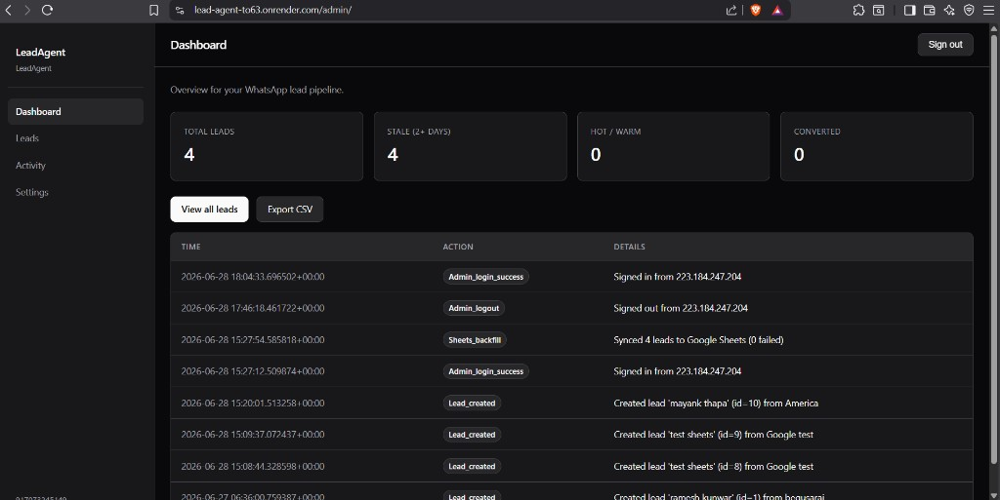
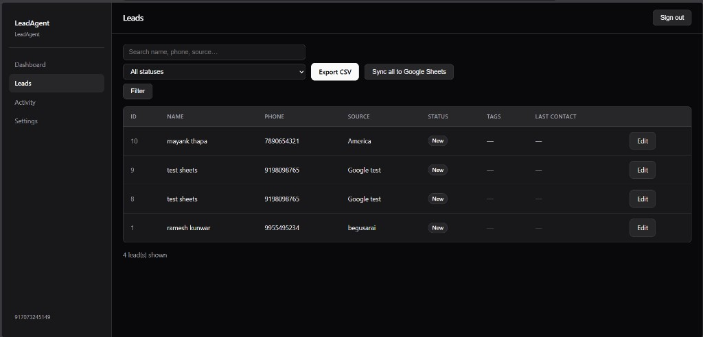
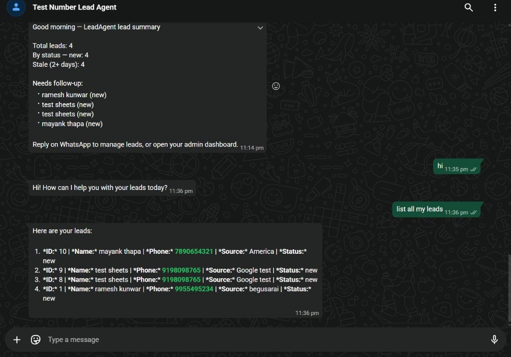
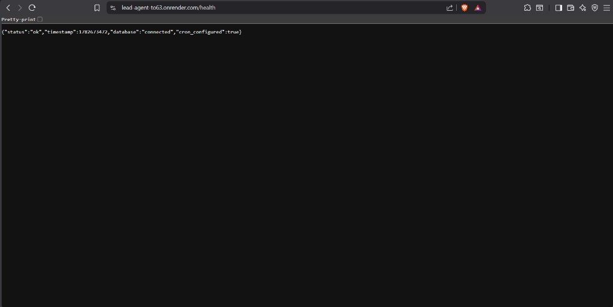

# LeadAgent

**Stop losing WhatsApp leads. Your team texts a bot in Hindi or English — it organizes follow-ups, updates status, and backs up to Google Sheets.**

Indian real estate teams, coaching centers, and SMBs get most leads on WhatsApp. Nobody has time to update Excel at 11 PM. LeadAgent is an **AI sales assistant on WhatsApp** — plus a simple admin dashboard when you want a full table view.

**What you get**
- New lead from website or IndiaMART → instant WhatsApp alert to the team
- *"Surat ke leads kaun follow-up pending hain?"* → answer in seconds
- Mark converted / send follow-up → bot asks **YES** before anything goes to a customer
- Subah 9 baje: stale leads ka summary sab owners ko
- Sheet backup — same lead update hoti hai, duplicate row nahi

**Live demo:** [Admin portal](https://lead-agent-to63.onrender.com/admin/login) · **API health:** [/health](https://lead-agent-to63.onrender.com/health) · **Code:** [github.com/ayushanand27/Lead-Agent](https://github.com/ayushanand27/Lead-Agent)

[](https://github.com/ayushanand27/Lead-Agent/actions/workflows/ci.yml)

---

## See it working

| Dashboard | Leads + Edit | WhatsApp bot | Live deployment |
|:---:|:---:|:---:|:---:|
|  |  |  | [](https://lead-agent-to63.onrender.com/health) |

**Health endpoint (devs / uptime):** [lead-agent-to63.onrender.com/health](https://lead-agent-to63.onrender.com/health) — JSON: `database: connected`, `cron_configured: true`

---

## Example: real estate team (Surat)

1. **IndiaMART** se lead aata hai → Zapier → LeadAgent → **WhatsApp alert:** *"New lead: Ramesh, 98765…, 2BHK Surat"*
2. Agent message karta hai: *"Surat ke stale leads dikhao"*
3. Bot: *"3 leads — Ramesh (warm), Priya (new), Amit (follow-up)…"*
4. *"Ramesh ko follow-up draft karo"* → preview → **YES** → message draft ready
5. Subah cron: *"Good morning — 12 total leads, 4 stale 2+ days"*
6. Partner bhi same leads dekhta hai (`BUSINESS_OWNER_PHONES`) — shared pool

Set `BUSINESS_INDUSTRY=real_estate` to tune the agent prompt for property vocabulary.

---

## For developers

WhatsApp Lead Management Agent — MCP-powered stack for Indian SMBs.

Indian SMB owners manage sales leads over WhatsApp in plain English or Hindi. A **real MCP server** with typed tools, **Groq** agent loop (`openai/gpt-oss-120b`), **FastAPI** webhook on Meta WhatsApp Cloud API. Confirmation before sends and terminal status changes. Multi-owner shared lead pool.

**Full technical docs:** [lead-agent/README.md](lead-agent/README.md)  
**Client handover:** [CLIENT_SETUP.md](lead-agent/docs/CLIENT_SETUP.md) · [CLIENT_GUIDE.md](lead-agent/docs/CLIENT_GUIDE.md) · [ZAPIER_INDIA_MART.md](lead-agent/docs/ZAPIER_INDIA_MART.md)

---
## Architecture

```
WhatsApp / Webhook  →  Render (FastAPI)  →  Groq agent  →  MCP tools (×11)  →  Supabase Postgres
        ↑                      │                                    │
   Meta Cloud API         /admin dashboard                    Google Sheets
   cron-job.org           lead webhook API                     (Apps Script)
```

---

## Quick start

```bash
git clone https://github.com/ayushanand27/Lead-Agent.git
cd Lead-Agent/lead-agent
python -m venv .venv && .venv\Scripts\activate   # Windows
pip install -r requirements.txt
cp .env.example .env
python scripts/test_read_tools.py
uvicorn app.main:app --reload --port 8000
```

---

## Production stack

| Layer | Technology |
|-------|------------|
| API | FastAPI + Uvicorn (Python 3.11) |
| Agent | Groq `openai/gpt-oss-120b` + MCP (official SDK) |
| Messaging | Meta WhatsApp Cloud API |
| Database | Supabase Postgres (persistent) |
| Hosting | Render.com |
| Cron | [cron-job.org](https://cron-job.org) (daily summary) |
| CI | GitHub Actions |

**Demo hosting:** Render free tier is fine for portfolio + LinkedIn. Ping `/health` every 5 min ([UptimeRobot](https://uptimerobot.com)) or rely on daily cron to keep the service warm. **Paid clients** cover Render Starter (~$7/mo) in their setup fee.

---
## Status (verified 12 Aug 2026)

| Feature | Status |
|---------|--------|
| MCP read/write tools (11, incl. `delete_lead`) | ✅ |
| Groq agent + confirmation flow | ✅ |
| WhatsApp webhook + HMAC validation | ✅ |
| Multi-owner shared lead pool | ✅ |
| Admin dashboard (edit, tags, CSV, activity) | ✅ |
| Google Sheets upsert sync | ✅ |
| Lead capture webhook (`POST /api/leads`) | ✅ |
| WhatsApp alert on new webhook lead | ✅ |
| Daily summary cron (9 AM IST) | ✅ |
| Supabase Postgres | ✅ |
| Deployed on Render | ✅ |
| Meta test sandbox (up to 5 recipients) | ✅ |
| Automated test suite + CI | ✅ 67/67 checks passing locally (63 pytest + 4 script suites incl. live Groq agent loop) |
| Optional Sarvam AI voice transcription (Indian languages) | ✅ opt-in, falls back to Groq Whisper |
| Dashboard: delete a lead (not just via WhatsApp) | ✅ |
| Delete a lead (WhatsApp + confirmation gate) | ✅ |
| CSRF protection on authenticated admin forms | ✅ |
| `POST /api/leads` rate limiting | ✅ |
| Locked, reproducible dependency versions (`requirements-lock.txt`) | ✅ |

Remaining known gap (tracked in [lead-agent/README.md § Security](lead-agent/README.md#security)): `ADMIN_DASHBOARD_PASSWORD` still accepts a legacy plain-text fallback for backward compatibility — the app now logs a startup warning when it's not a bcrypt hash, but doesn't refuse to boot, so existing deploys keep working while you migrate.

---
## License

**Proprietary — all rights reserved.** See [LICENSE](LICENSE).

Unauthorized copying, redistribution, or commercial use without written permission is prohibited.

> **Portfolio note:** After demo recording, set this repo to **private** (invite-only). Steps: [docs/PRIVATE_REPO.md](docs/PRIVATE_REPO.md). Live demo stays at [lead-agent-to63.onrender.com/admin/login](https://lead-agent-to63.onrender.com/admin/login).
